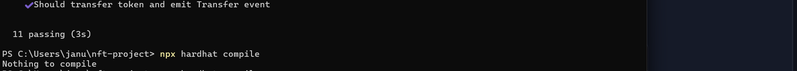
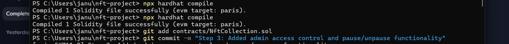
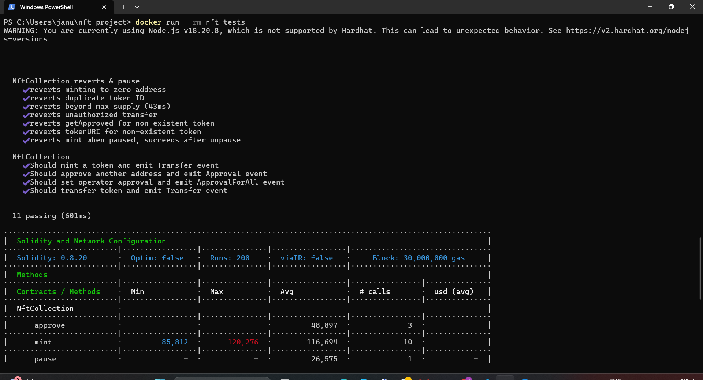
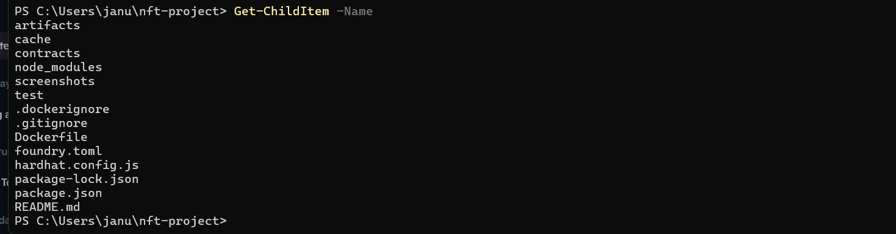
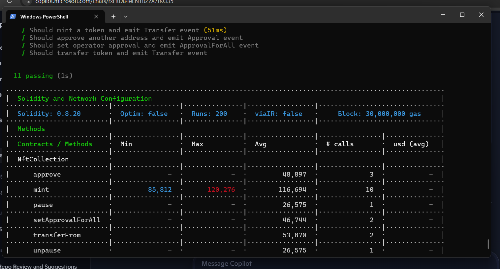

# 🖼️ NFT Smart Contract Project

## 📌 Overview
This project implements a fully functional **ERC‑721 NFT smart contract** with:
- Minting logic (with max supply limit)
- Approvals (`approve`, `setApprovalForAll`)
- Transfers (`transferFrom`, `safeTransferFrom`)
- Metadata support (`tokenURI`)
- Admin access control (`pause`, `unpause`)
- Comprehensive automated test suite (positive, negative, and pause coverage)
- Dockerized test environment for reproducibility

Built using **Hardhat**, **Node.js**, **Solidity**, and **Docker**.

---

## ⚙️ Setup Instructions

### Prerequisites
- Node.js v18+
- npm
- Hardhat (installed via `npm ci`)
- Docker (optional for containerized testing)

### Install dependencies
```bash
npm ci
```

### Compile contract
```bash
npx hardhat compile
```

### Run tests
```bash
npx hardhat test
```

---

## 🧪 Automated Test Suite

### ✅ Coverage
- **Positive tests:**
  - Minting emits `Transfer` and stores metadata
  - Approvals emit `Approval`
  - Operator approvals emit `ApprovalForAll`
  - Transfers update ownership and emit `Transfer`

- **Negative tests:**
  - Mint to zero address
  - Duplicate token ID
  - Mint beyond max supply
  - Unauthorized transfer
  - `getApproved` and `tokenURI` on non-existent token

- **Pause/unpause:**
  - Minting fails when paused
  - Minting succeeds after unpause

---

## 📸 Screenshots

### Compile Proof


### Local Test Run


### Docker Test Run


### Project Structure


---

## 🐳 Docker Instructions

### Build image
```bash
docker build -t nft-tests .
```

### Run tests inside container
```bash
docker run --rm nft-tests
```

Expected output:
```
11 passing
```

---

## 📜 Contract Summary

### Functions
- `mint(address to, uint256 tokenId, string uri)`
- `approve(address to, uint256 tokenId)`
- `setApprovalForAll(address operator, bool approved)`
- `transferFrom(address from, address to, uint256 tokenId)`
- `safeTransferFrom(...)`
- `tokenURI(uint256 tokenId)`
- `pause()`, `unpause()`

### Events
- `Transfer(address from, address to, uint256 tokenId)`
- `Approval(address owner, address approved, uint256 tokenId)`
- `ApprovalForAll(address owner, address operator, bool approved)`

### Invariants
- Cannot mint to zero address
- Cannot mint duplicate token IDs
- Cannot exceed max supply
- Minting blocked when paused

## 📊 Benchmark Results

Gas usage measured with Hardhat Gas Reporter:

- **Mint**: Avg ~116,694 gas
- **TransferFrom**: ~53,870 gas
- **Approve**: ~48,897 gas
- **SetApprovalForAll**: ~46,744 gas
- **Pause/Unpause**: ~26,575 gas
- **Deployment**: ~2,457,267 gas

### Benchmark Proof



## 📦 Submission Checklist
- ✅ Contract compiles
- ✅ Tests pass locally and in Docker
- ✅ Negative and pause coverage included
- ✅ Dockerfile present
- ✅ README polished
- ✅ Screenshot/logs embedded

---

